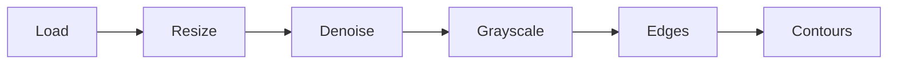
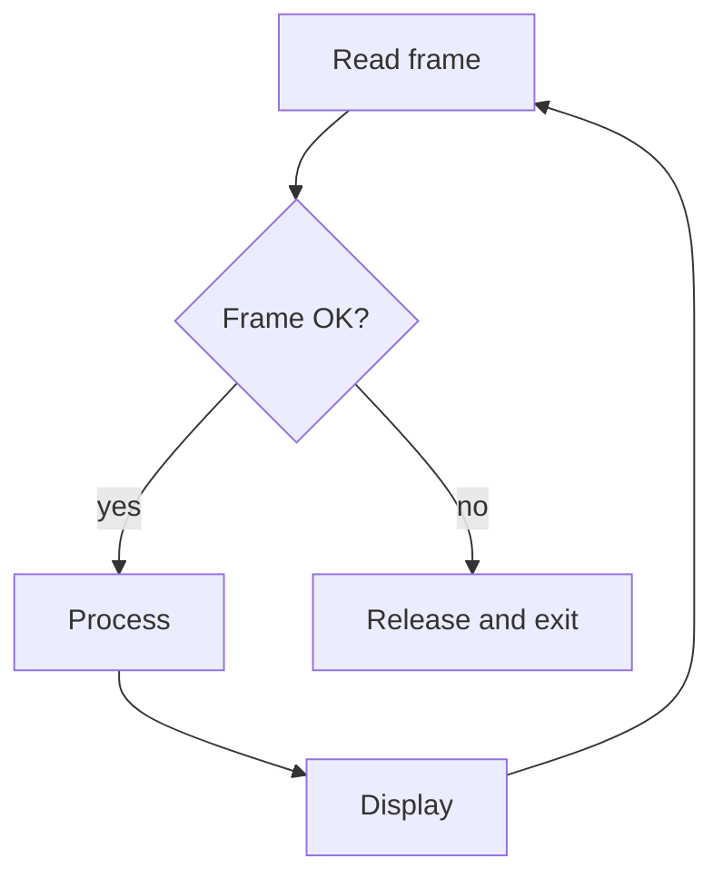

# Mermaid diagrams for notes

Diagrams in notes are ONLY ```mermaid fences. The site renders them to themed SVG. Never draw ASCII art for flows.

## Choose the type

| Need                                  | Use                                                             |
| ------------------------------------- | --------------------------------------------------------------- |
| Pipeline, process, decision           | `flowchart LR` (short chains) or `flowchart TD` (long/vertical) |
| Messages between components over time | `sequenceDiagram`                                               |
| Lifecycle, modes                      | `stateDiagram-v2`                                               |
| Classes, modules and relations        | `classDiagram`                                                  |
| Tables and keys                       | `erDiagram`                                                     |
| Timeline / schedule                   | `gantt`                                                         |

## Do NOT use a diagram for

Coordinate axes, number lines, pixel/matrix/memory layouts, directory trees, tables, formulas. Use a Markdown table, a plain ``` code block, or a list.

## Syntax rules (prevent parse errors)

1. Node IDs: letters and digits only (`load`, `n1`). Labels go in brackets: `load["Load image"]`.
2. Always quote labels that contain punctuation, parentheses, slashes, colons, `<`, `>`, `|` or `%`: `A["cv2.imread(path)"]`.
3. Use `-->` for edges, `-->|label|` for labelled edges, `-.->` for optional, `==>` for emphasis. Never use unicode arrows.
4. Decision node: `d{"Found?"}`; branches `d -->|yes| a` and `d -->|no| b`.
5. Group with `subgraph id["Title"]` ... `end`. Do not nest more than 2 levels.
6. No `classDef`, `style`, `linkStyle`, `%%{init}%%`, HTML labels, `<br>` or emoji. The site owns the theme.
7. Line breaks inside a label: use a shorter label instead. Keep labels under about 30 characters.
8. Keep diagrams to 12 nodes or fewer. Split larger ones into two diagrams with a sentence between.
9. One blank line before and after the fence. No text on the fence line except `mermaid`.

## Templates





## Converting an ASCII diagram

1. Read it and list the nodes (box or word labels) and the arrows between them.
2. If it is a ruler, axes, layout or table, do NOT convert. Replace with a table or leave as a code block.
3. Otherwise choose LR for left-to-right chains, TD for vertical ones.
4. Rewrite with short IDs and quoted labels. Preserve the meaning and the order; do not invent steps.
5. Replace the original block with the mermaid fence. Add one sentence of context if the diagram was unlabelled.

## Final check

Every fence starts with a valid diagram keyword, all labels with special characters are quoted, there is no styling, and no more than 12 nodes. When unsure a construct is valid, use the simpler form.OPenCV
